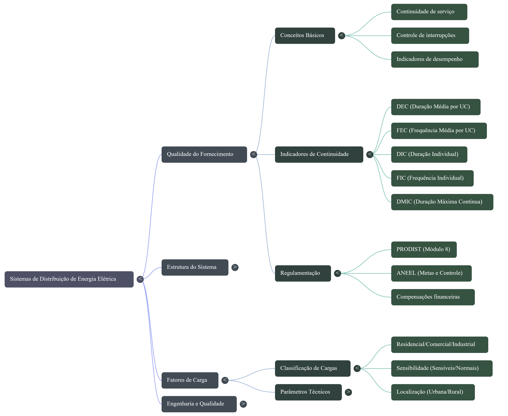

\thispagestyle{empty}

\newpage
\pagenumbering{roman}
```{=latex}
\setcounter{tocdepth}{4}
\renewcommand{\contentsname}{SUMÁRIO}
\tableofcontents
```

\newpage

```{=latex}
\setcounter{tocdepth}{4}
\renewcommand{\listfigurename}{LISTA DE FIGURAS}
\listoffigures
```

```{python}
#| echo: false
#| error: false
#| warning: false
from IPython.display import Markdown
from tabulate import tabulate
import math
import statistics
import numpy as np
import pandas as pd
import json
```

\newpage
\pagenumbering{arabic}

# INTRODUÇÃO

\newpage

# METODOLOGIA (O uso da IA com fontes controladas)

Este trabalho foi desenvolvido a partir de uma abordagem prática que une a pesquisa bibliográfica tradicional ao uso de ferramentas de Inteligência Artificial (IA). A intenção foi aproveitar o potencial da tecnologia para otimizar o estudo, facilitando a síntese e a fixação de conceitos envolvidos na qualidade do fornecimento de energia elétrica.

Para garantir a confiabilidade dos dados e evitar que a IA trouxesse informações incorretas — as chamadas alucinações —, a plataforma escolhida foi o NotebookLM. Essa ferramenta cria um ambiente de consulta fechado, baseando suas respostas apenas nos arquivos enviados pelo usuário. A base de dados utilizada foi restrita a duas fontes principais: o livro de referência "Introdução aos Sistemas de Distribuição de Energia Elétrica", de Nelson Kagan, Carlos César Barioni de Oliveira e Ernesto João Robba (2ª edição, Editora Blucher, 2010)(@kagan2010introducao), e o material de apoio pedagógico da disciplina, composto pelos slides da "Aula 4 - Qualidade de Fornecimento" (@slides_aula4_qualidade), preparados pelo professor Paulo Victor de Souza Borges no CEFET/RJ - Nova Friburgo.

Com as fontes devidamente controladas dentro da plataforma, o trabalho seguiu por duas etapas:

  1.  Extração Teórica: Levantamento detalhado dos conceitos, critérios e fórmulas que definem os indicadores de continuidade (DIC, FIC, DMIC, DEC e FEC).

  2.  Geração de Artefatos Didáticos: Construção de comandos específicos na IA para estruturar cinco materiais de estudo: um resumo dinâmico, um mapa mental, cartões didáticos (flashcards), testes de conhecimento e um infográfico técnico.

Por fim, a escrita de todo o texto, a organização do conteúdo e a geração do arquivo PDF final foram feitas no ambiente de desenvolvimento Visual Studio Code (VS Code) com a ferramenta Quarto, o que garantiu uma formatação limpa e adequada aos padrões científicos.
\newpage

# DESENVOLVIMENTO

## Fundamentação Teórica (DIC, FIC, DEC, FEC, DMIC)

\newpage

## Resumo

\newpage

## Mapa Mental



\newpage

## Cartões Didáticos

\newpage

## Testes de Conhecimento

\newpage

## Infográfico

\newpage

# CONCLUSÃO

\newpage

# BIBLIOGRÁFIA