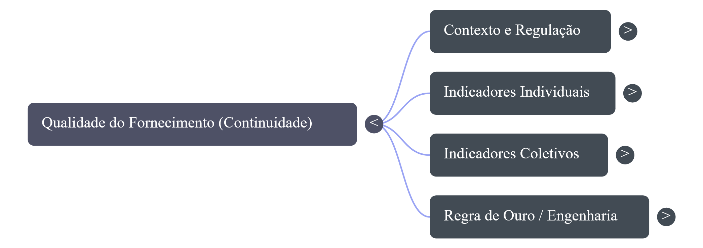
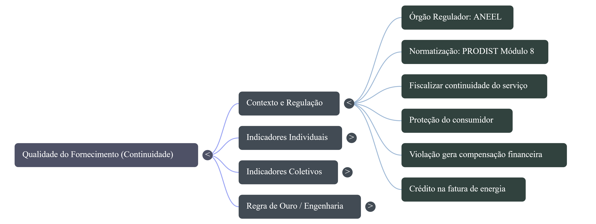
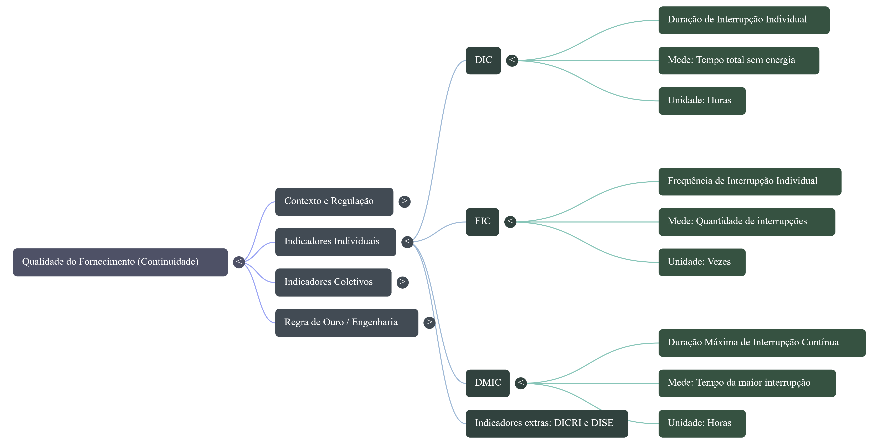
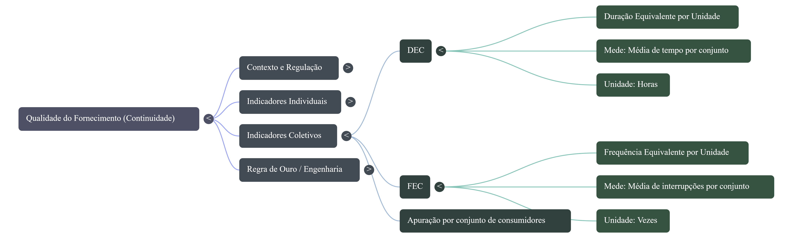

\thispagestyle{empty}

\newpage
\pagenumbering{roman}
```{=latex}
\setcounter{tocdepth}{4}
\renewcommand{\contentsname}{SUMÁRIO}
\tableofcontents
```

\newpage

```{=latex}
\setcounter{tocdepth}{4}
\renewcommand{\listfigurename}{LISTA DE FIGURAS}
\listoffigures
```

```{python}
#| echo: false
#| error: false
#| warning: false
from IPython.display import Markdown
from tabulate import tabulate
import math
import statistics
import numpy as np
import pandas as pd
import json
```

\newpage
\pagenumbering{arabic}

# INTRODUÇÃO

Garantir que a energia elétrica chegue sem interrupções às casas e indústrias é um dos maiores desafios da engenharia de distribuição. No Brasil, essa qualidade do serviço não é apenas uma meta técnica, mas uma exigência legal fiscalizada de perto pela ANEEL. É por meio do PRODIST Módulo 8 (@aneel2026prodist8) que a agência reguladora define as regras do jogo, estabelecendo limites rigorosos para o tempo e a quantidade de vezes que o consumidor pode ficar sem luz.

Para medir se uma distribuidora está prestando um bom serviço, a engenharia e a regulação utilizam indicadores matemáticos de qualidade do serviço. Eles funcionam em duas frentes: os coletivos (DEC e FEC), que analisam o comportamento geral do sistema por conjuntos de consumidores (@kagan2010introducao), e os individuais (DIC, FIC e DMIC), que olham diretamente para a realidade de cada cliente em seu ponto de consumo. Dominar esses conceitos e suas fórmulas é indispensável para quem atua no setor elétrico.

A assimilação dessa densidade de conceitos teóricos e regulatórios exige métodos de estudo eficientes durante a formação acadêmica. Diante disso, este trabalho propõe alinhar a fundamentação técnica a uma abordagem prática de aprendizado, demonstrando como o uso estratégico da Inteligência Artificial com fontes controladas pode otimizar a fixação desse conteúdo. Como resultado dessa proposta, foram desenvolvidos cinco materiais de apoio: um resumo dinâmico, um mapa mental, cartões didáticos (*flashcards*), testes de conhecimento e um infográfico técnico.

\newpage

# METODOLOGIA (O uso da IA com fontes controladas)

Este trabalho foi desenvolvido a partir de uma abordagem prática que une a pesquisa bibliográfica tradicional ao uso de ferramentas de Inteligência Artificial (IA). A intenção foi aproveitar o potencial da tecnologia para otimizar o estudo, facilitando a síntese e a fixação de conceitos envolvidos na qualidade do fornecimento de energia elétrica.

Para garantir a confiabilidade dos dados e evitar que a IA trouxesse informações incorretas — as chamadas alucinações —, a plataforma escolhida foi o NotebookLM. Essa ferramenta cria um ambiente de consulta fechado, baseando suas respostas apenas nos arquivos enviados pelo usuário. A base de dados utilizada foi restrita a três fontes principais: o livro de referência "Introdução aos Sistemas de Distribuição de Energia Elétrica", de Nelson Kagan, Carlos César Barioni de Oliveira e Ernesto João Robba (2ª edição, Editora Blucher, 2010) (@kagan2010introducao), o documento regulatório do PRODIST Módulo 8 da ANEEL (@aneel2026prodist8) e o material de apoio pedagógico da disciplina, composto pelos slides da "Aula 4 - Qualidade de Fornecimento" (@slides_aula4_qualidade), preparados pelo professor Paulo Victor de Souza Borges no CEFET/RJ - Nova Friburgo.

Com as fontes devidamente controladas dentro da plataforma, o trabalho seguiu por duas etapas:

   1. Extração Teórica: Levantamento detalhado dos conceitos, critérios e fórmulas que definem os indicadores de continuidade (DIC, FIC, DMIC, DEC e FEC).

   2. Geração de Artefatos Didáticos: Construção de comandos específicos na IA para estruturar cinco materiais de estudo: um **resumo dinâmico**, um **mapa mental**, **cartões didáticos** (***flashcards***), **testes de conhecimento** e um **infográfico** técnico.

Por fim, a escrita de todo o texto, a organização do conteúdo e a geração do arquivo PDF final foram feitas no ambiente de desenvolvimento Visual Studio Code (VS Code) com a ferramenta Quarto, o que garantiu uma formatação limpa e adequada aos padrões científicos.

\newpage

# DESENVOLVIMENTO

## Fundamentação Teórica (DIC, FIC, DEC, FEC, DMIC)

\newpage

## Resumo Dinâmico

### Prompt

A partir dos materiais fornecidos como fonte, crie um Resumo Dinâmico sobre a Qualidade do Fornecimento de Energia Elétrica, focando nos indicadores de continuidade.

Orientações de escopo e fontes:

  * Para a fundamentação teórica clássica e as equações matemáticas, baseie-se especificamente no Capítulo 8 (foco na seção 8.2) do livro do Nelson Kagan(@kagan2010introducao).

  * Para a contextualização regulatória e os limites/padrões atuais vigentes, baseie-se no documento fornecido do PRODIST Módulo 8 da ANEEL.

  * Em caso de qualquer divergência ou contradição em relação às fórmulas matemáticas entre os slides da Aula 4 e o livro do Nelson Kagan, adote estritamente a versão e as equações apresentadas no livro.

  * Utilize os slides da Aula 4 do professor Paulo Victor para alinhar a abordagem pedagógica com a dinâmica da disciplina.

Organize o resumo nos seguintes tópicos:

  * Contextualização Regulatória: O papel do PRODIST Módulo 8 na qualidade da distribuição de energia no Brasil.

  * Indicadores Individuais: Definição clara, critérios e fórmulas de cálculo para DIC, FIC e DMIC (conforme o capítulo 8.2 do livro).

  * Indicadores Coletivos: Definição clara, critérios e fórmulas de cálculo para DEC e FEC (conforme o capítulo 8.2 do livro).

  * Impacto e Aplicação: Como esses indicadores afetam o consumidor e o papel deles na regulação e fiscalização das distribuidoras.

Importante: Mantenha rigorosamente as nomenclaturas e a precisão matemática das fórmulas do livro, cruzando com os conceitos regulatórios do PRODIST.

\newpage

### Resumo - Qualidade do Fornecimento de Energia Elétrica: Resumo Dinâmico de Indicadores de Continuidade

Este documento apresenta uma análise técnica e regulatória sobre a qualidade do serviço de distribuição de energia elétrica no Brasil, com foco central nos indicadores de continuidade. A síntese integra os fundamentos teóricos de Nelson Kagan, as normas do PRODIST (ANEEL) e a abordagem pedagógica da disciplina para fornecer uma visão exaustiva do tema.

1. Contextualização Regulatória: O Papel do PRODIST Módulo 8

A regulação da qualidade do serviço de distribuição no Brasil é conduzida pela Agência Nacional de Energia Elétrica (ANEEL) por meio dos Procedimentos de Distribuição de Energia Elétrica no Sistema Elétrico Nacional (PRODIST). O Módulo 8 é o documento normativo que padroniza as atividades técnicas relacionadas à qualidade da energia elétrica.

Importância e Evolução

Historicamente, os sistemas de distribuição receberam menos atenção em modelagem de confiabilidade comparados à geração e transmissão, cujas falhas podem ser catastróficas e generalizadas. Contudo, estatísticas de concessionárias demonstram que a distribuição é o segmento que mais contribui individualmente para a indisponibilidade de fornecimento ao consumidor final.

Com a privatização de grande parte das distribuidoras, o controle da qualidade tornou-se um pilar fundamental para garantir os direitos do consumidor e a universalização do acesso. O controle das interrupções permite que:

   * Distribuidoras e Consumidores: Avaliem o desempenho do sistema e a qualidade do serviço prestado.
   * ANEEL: Fiscalize e regule o setor, estabelecendo metas anuais, trimestrais e mensais para as concessionárias.

2. Indicadores Individuais: DIC, FIC e DMIC

Os indicadores individuais aferem a continuidade do fornecimento em cada unidade consumidora (UC). De acordo com o Módulo 8 do PRODIST e a fundamentação de Nelson Kagan, as definições e cálculos são os seguintes:

DIC (Duração de Interrupção Individual por Unidade Consumidora)

Exprime o tempo total que um consumidor específico ficou privado do fornecimento de energia elétrica em um período de apuração (mensal, trimestral ou anual).

Fórmula (Conforme Nelson Kagan)(@kagan2010introducao): $DIC = \sum_{i=1}^{N} t(i)$

   * $t(i)$: Duração da interrupção $i$.
   * $N$: Número de ocorrências no período de estudo.

FIC (Frequência de Interrupção Individual por Unidade Consumidora)

Indica a quantidade de vezes que o consumidor experimentou interrupções no período de apuração.

Fórmula (Conforme Nelson Kagan)(@kagan2010introducao): $FIC = N$

   * $N$: Número total de interrupções ocorridas para a unidade consumidora no período de observação.

DMIC (Duração Máxima de Interrupção Contínua por Unidade Consumidora)

Representa o tempo da maior interrupção contínua de energia elétrica sofrida por uma unidade consumidora.

Fórmula (Conforme Nelson Kagan)(@kagan2010introducao): $DMIC = \max_{i=1, \dots, N} \{t(i)\}$

   * $t(i)$: Duração individual de cada evento de interrupção.

3. Indicadores Coletivos: DEC e FEC

Os indicadores coletivos avaliam o desempenho de um conjunto de unidades consumidoras (agrupamento de UCs de uma mesma área), refletindo a média de interrupções para esse grupo.

DEC (Duração Equivalente de Interrupção por Unidade Consumidora)

Exprime o tempo médio que cada consumidor do conjunto ficou sem energia elétrica no período considerado.

Fórmula (Conforme Nelson Kagan)(@kagan2010introducao): $DEC = \frac{\sum_{i=1}^{N} C_a(i) \times t(i)}{C_s}$

Variável	Definição
$C_a(i)$	Número de consumidores atingidos na interrupção $i$.
$t(i)$	Duração da interrupção $i$.
$C_s$	Número total de consumidores existentes no conjunto/área em estudo.
$N$	Número total de ocorrências no período.

FEC (Frequência Equivalente de Interrupção por Unidade Consumidora)

Indica quantas vezes, em média, as unidades consumidoras de um determinado conjunto sofreram interrupções.

Fórmula (Conforme Nelson Kagan)(@kagan2010introducao): $FEC = \frac{\sum_{i=1}^{N} C_a(i)}{C_s}$

   * O cálculo do FEC foca na abrangência das falhas em relação ao total de consumidores, sem considerar a duração das mesmas.

4. Impacto e Aplicação na Regulação e Fiscalização

A aplicação desses indicadores impacta diretamente a relação entre a distribuidora e o consumidor, além de nortear a fiscalização da ANEEL.

Transparência e Faturamento

Conforme o Módulo 8 do PRODIST, os valores mensais apurados de DIC, FIC e DMIC devem ser obrigatoriamente disponibilizados na fatura de energia elétrica. A conta deve exibir:

   * Apurado Mensal: O valor real registrado para a unidade consumidora.
   * Meta Mensal: O limite máximo de continuidade estabelecido pela ANEEL para aquele cliente.

Violações e Compensações Financeiras

Ocorre violação quando o valor apurado é superior à meta estabelecida. O consumidor tem o direito de receber uma compensação financeira caso as metas de continuidade individuais (mensais, trimestrais ou anuais) sejam violadas.

   * Exemplo Real (2021): No Brasil, a disponibilidade média do serviço foi de 99,86%. Apesar disso, as distribuidoras pagaram R$ 718,5 milhões em compensações aos consumidores devido a violações de indicadores.

Fiscalização das Distribuidoras

A ANEEL utiliza o DEC e o FEC para classificar o desempenho das empresas. Concessionárias de grande porte (mais de 400 mil UCs) são avaliadas pelo DGC (Desempenho Global de Continuidade); quanto menor o índice, melhor a avaliação da empresa. A tendência histórica mostra que a regulação tem sido eficaz em reduzir os limites permitidos (metas da ANEEL) ao longo dos anos, forçando as empresas a investirem na redução da duração e frequência das interrupções.

\newpage

## Mapa Mental

### Prompt

A partir das fontes fornecidas — Capítulo 8 (seção 8.2) do livro do Nelson Kagan, slides da Aula 4 do professor Paulo Victor e o documento do PRODIST Módulo 8 —, estruture o conteúdo para a criação de um Mapa Mental sobre a Qualidade do Fornecimento (Indicadores de Continuidade).

Como o objetivo é criar um mapa mental, organize a resposta estritamente em uma estrutura hierárquica de tópicos e subtópicos (usando recuos ou bullet points), dividida em 4 ramificações principais a partir do nó central:

Nó Central: Qualidade do Fornecimento (Continuidade)

   * Ramificação 1: Contexto e Regulação (Fonte: PRODIST Módulo 8)

      * Órgão regulador (ANEEL).

      * Objetivo dos indicadores (fiscalizar a continuidade do serviço e proteger o consumidor).

      * Consequência da violação dos limites (compensações financeiras).

   * Ramificação 2: Indicadores Individuais (Fonte: Livro do Kagan - Cap. 8.2)

      * Subtópicos para DIC, FIC e DMIC: Para cada um, indique o nome por extenso, o que mede (tempo, frequência ou pior caso) e a unidade de medida.

   * Ramificação 3: Indicadores Coletivos (Fonte: Livro do Kagan - Cap. 8.2)

      * Subtópicos para DEC e FEC: Para cada um, indique o nome por extenso, o que mede (média de tempo ou frequência por conjunto de consumidores) e a unidade de medida.

   * Ramificação 4: Regra de Ouro / Engenharia (Fonte: Alinhamento das fontes)

      * Diferença crucial entre a visão individual (foco no consumidor) e coletiva (foco no sistema/conjunto).

      * Prioridade matemática: Fórmulas oficiais extraídas estritamente do livro do Kagan.

Orientações de formato: Não escreva parágrafos longos. Use apenas palavras-chave e frases curtíssimas para os nós, garantindo que a estrutura visual do mapa mental seja fácil de ler e montar.

\newpage

### Mapas mental





\newpage






\newpage

## Cartões Didáticos

\newpage

## Testes de Conhecimento

### Prompt

A partir das fontes fornecidas — Capítulo 8 (seção 8.2) do livro do Nelson Kagan, slides da Aula 4 do professor Paulo Victor e o documento do PRODIST Módulo 8 —, crie um Teste de Conhecimento abrangente sobre a Qualidade do Serviço, focado nos Indicadores de Continuidade.

Não há um limite fixo para a quantidade de questões; gere quantas forem necessárias para cobrir os seguintes eixos temáticos:

   1. Diferenciação de Escopo: Questões conceituais que avaliem a distinção clara entre os indicadores individuais (DIC, FIC, DMIC) e os indicadores coletivos (DEC, FEC), contrastando a ótica do ponto de consumo individual com a análise global do sistema/conjunto.

   2. Contexto Regulatório e Impacto: Questões sobre as diretrizes do PRODIST Módulo 8 da ANEEL, abordando o estabelecimento de limites, a fiscalização e os mecanismos de compensação financeira ao consumidor em caso de violação dos padrões.

   3. Interpretação Matemática e Variáveis: Questões que testem o entendimento das equações matemáticas de cada indicador (individuais e coletivos), baseando-se estritamente nas fórmulas e no dicionário de variáveis apresentados no capítulo 8.2 do livro do Nelson Kagan.

   4. Análise de Cenários Práticos: Questões situacionais que apresentem eventos de interrupção (ex: desligamentos de grande porte em subestações versus falhas isoladas em ramais de ligação) e exijam a identificação de quais indicadores foram afetados.

Formato da Resposta:

   * Cada questão deve ser de múltipla escolha, contendo obrigatoriamente alternativas de A a E.

   * Ao final do teste, apresente um Gabarito Comentado detalhado, explicando o motivo pelo qual a alternativa correta está certa e justificando brevemente o erro das opções incorretas, sempre amparado pelas fontes fornecidas.

Importante: Mantenha a precisão técnica da engenharia e da regulação, garantindo o rigor matemático contido no livro do Kagan.

\newpage

### Teste

\newpage

## Infográfico

### Prompt

A partir do Capítulo 8 (especificamente a seção 8.2) do livro do Nelson Kagan, dos slides da Aula 4 do professor Paulo Victor e do documento do PRODIST Módulo 8, estruture o conteúdo conceitual e matemático para a criação de um Infográfico Técnico sobre os indicadores de continuidade.

Como este conteúdo será usado em um infográfico, organize a resposta em blocos de texto curtos, diretos e esquemáticos, seguindo as diretrizes abaixo:

   1. **Hierarquia de Fontes**: Para a definição das fórmulas e explicação das variáveis, baseie-se estritamente no livro do Nelson Kagan. Em caso de qualquer divergência com os slides, a versão do livro deve prevalecer. Use o PRODIST Módulo 8 para indicar quais desses indicadores são individuais e quais são coletivos sob a ótica regulatória da ANEEL.

   2. **Estrutura por Indicador** (**DIC**, **FIC**, **DMIC**, **DEC**, **FEC**): Para cada um dos 5 indicadores, crie um bloco de informação contendo:

      *  Nome por extenso e tipo: (Ex: DIC - Indicador Individual).

      *  Conceito Direto: O que ele mede em apenas uma frase simples.

      *  Equação Matemática: A fórmula exata em formato limpo.

      *  Dicionário de Variáveis: O significado de cada letra/termo usado na fórmula e a unidade de medida (ex: horas, interrupções).

   3. Seção de Fechamento (**O Impacto Regulatório**): Um pequeno bloco explicando o que acontece se a distribuidora violar os limites desses indicadores estabelecidos pelo PRODIST (ex: direito à compensação financeira ao consumidor).

**Importante**: Evite parágrafos longos. Foque em listas (bullet points) e dados objetivos para facilitar a posterior diagramação visual do infográfico.

\newpage

### Infográfico

{}

\newpage

## Podcast

### Prompt

Instruções para os Apresentadores do Podcast (Audio Overview):

Vocês são engenheiros especialistas em sistemas de distribuição de energia elétrica. Gerem um podcast de análise profunda sobre a "Qualidade do Serviço de Fornecimento de Energia Elétrica" baseando-se estritamente nos documentos fornecidos e seguindo estas diretrizes:

1. CONCEITOS TÉCNICOS CENTRAIS: Expliquem com clareza a diferença entre os indicadores de continuidade coletivos (DEC e FEC) e os indicadores de continuidade individuais (DIC, FIC, DMIC).
2. HIERARQUIA DE FONTES (CRÍTICO): Se vocês identificarem qualquer divergência ou contradição nas fórmulas entre os slides da sala de aula ("Aula 4") e o livro-texto, vocês DEVEM se basear estritamente no livro-texto ("Introdução aos Sistemas de Distribuição de Energia Elétrica" do Nelson Kagan), especificamente no Capítulo 8, Seção 8.2 (Continuidade de Fornecimento), como a fonte absoluta e correta para todas as equações e definições.
3. MARCO REGULATÓRIO: Conectem esses conceitos diretamente às normas regulatórias da ANEEL estabelecidas no Módulo 8 do PRODIST.
4. APLICAÇÃO LOCAL E COMPLEXIDADE: Analisem o documento PDF "aneel-indicadores-continuidade-nova-friburgo-2025.pdf" que contém os indicadores de desempenho de 2025 para Nova Friburgo. Notem e destaquem que o atendimento no município é dividido entre distribuidoras diferentes dependendo do bairro ou região: a "Energisa Minas Rio" e a "Enel RJ". Discutam como essas concessionárias distintas se comportaram em relação aos limites de DEC e FEC e o que isso significa para os consumidores locais.
5. TERMINOLOGIA: Como todos os documentos de origem estão em português, citem explicitamente as siglas em português (DEC, FEC, DIC, FIC, DMIC) durante a discussão para que o áudio fique perfeitamente alinhado com o relatório técnico do estudante.

Mantenham um tom profissional, educativo e altamente dinâmico durante toda a conversa.

\newpage

# CONCLUSÃO

\newpage

# BIBLIOGRÁFIA